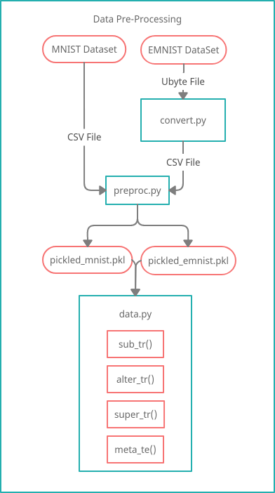
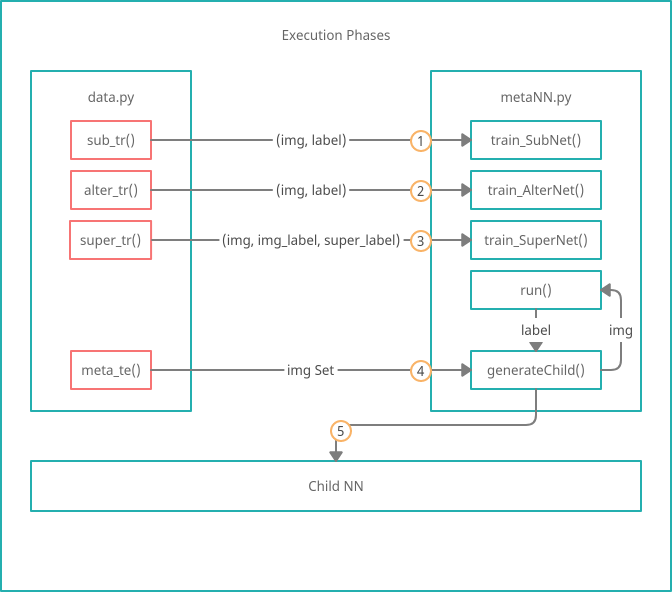
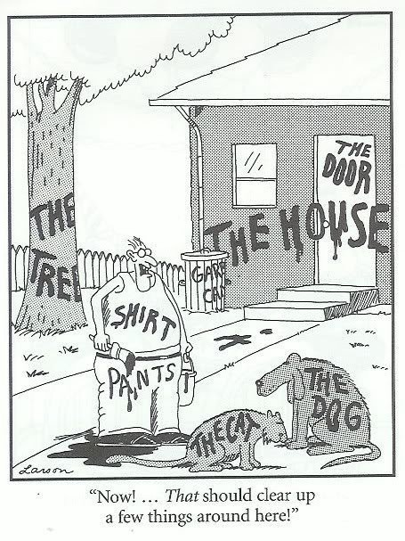

## Setup:

### Dependencies
	pip install numpy
	pip install matplotlib
	pip install scipy
	pip install pickle

### Installation
0. (Optional) Read the tutorial from [this website](https://www.python-course.eu/neural_network_mnist.php).

1. Download the MNIST [testing](https://www.python-course.eu/data/mnist/mnist_train.csv) and [training](https://www.python-course.eu/data/mnist/mnist_train.csv) datasets, and place them into the data/mnist folder.

2. Download the [EMNIST dataset](http://www.itl.nist.gov/iaui/vip/cs_links/EMNIST/gzip.zip).

    2.1 Extract the following files from the archive and place them into the data/emnist folder:

        emnist-letters-train-labels-idx1-ubyte
        emnist-letters-train-images-idx3-ubyte
        emnist-letters-test-labels-idx1-ubyte
        emnist-letters-test-images-idx3-ubyte

    2.2 Run convert.py to convert them into csv format

2. Run preproc.py (You only need to do this once).

3. Run codeTest.py

# Project Motivation
&nbsp;&nbsp;&nbsp;&nbsp; With traditional neural networks, inputs are classified according to a predetermined set of
possible outputs. While this is beneficial in situations where the categories are known ahead of
time and do not change, it does not allow for the formation of novel classifications. If an item
from a previously unseen category is presented, it will not be properly identified as something
new, but rather will be lumped into whichever existing category is the closest match.

&nbsp;&nbsp;&nbsp;&nbsp; In our project, we would like to develop a form of neural network which can identify novel categories and learn to classify items into those new categories over time. As proof of
concept, we will be focusing on identifying handwritten characters from the ​mnist handwritten
digit database​. Using supervised learning, we will first train a model that can reliably identify the numbers from 0-9, then we will give it letters from A-Z. When given letters, which it has never seen before, the NN should be able to (1) identify that they are not numbers, and (2) group the letters into clusters using unsupervised learning techniques.

# Algorithm Outline

### Data Processing

Before we do anything, we need to process the data into a format that we can readily access. The MNIST dataset already comes to us as a CSV file, but the extended MNIST is actually a series of ubyte files, and needs to be converted into CSV using the `convert.py` script.

After the datasets are in CSV format, we run `preproc.py` to pickle them for faster access.

Finally `data.py` encapsulates the data into a class that we can then import into our main code. Getter functions within the Data class automatically shuffle or split up the data and returns them for use.

  
  
  
  
  
  
  
  
  

### Execution Phases

Within the metaNN class there are three seperate neural networks, all of which need to be trained.

The subnet and the alternet, which recognize digits and letters respectively, are trained first. The subnet is trained on a set of 28,000 digit image / label pairs, and similarly the alternet is trained on a set of 28,000 letter image / label pairs.

The supernet, which classifies the subnet's output as "valid" or "invalid," is trained next. It is important that the supernet is trained after the subnet, as we need to use the output vector from a fully trained subnet as the input for the supernet. The supernet is trained on a mixed set of 14,000 digits and 14,000 letters, making for a total of 28,000 data points.

Once all three networks have been trained, we are ready to run the metaNet. Like the supernet training set, the metaNet testing set contains a mixed set of 28,000 letters and digits. An input image is first passed through the subnet, which generates an output vector. The supernet then uses that output vector as an input, and decides if the output from the subnet is valid or invalid. If the subnet output is deemed valid, then we generate a label from it and return it. If the subnet output is invalid, we instead use the label generated by the alternate network.

### Child Network Generation
Generating the child network is similar to the training phases we have seen before, with one small caveat. Rather than training the child using the labels provided in the dataset, we have the metaNet (the "parent" network) classify the image and generate a label for it. The parent-generated label is then used to train the child network.

Finally we test the accuracy of the child network by having it classify a mixed set of digits and letters by itself.

### Graphing Results
For each of the training phases, as well as the child generation and child testing phases, we build up a historical accuracy plot by starting with an empty list, and appending a 1 if the image was correctly classified, and appending a 0 otherwise. This is graphed using the Matplotlib plotting library.

# Code Documentation
## NN.py
Each NN instance is a neural network with a single hidden layer. The size of the input, hidden, and output layers (as well as the learning rate) are parameterized; the weights between layers are randomized at initialization.

The networks use the sigmoid function as the activation function, and a truncated normal distribution to generate randomized weights.

*Note: A good amount of the code came from [this tutorial](https://www.python-course.eu/neural_network_mnist.php) - the methods which were not written by us are marked by asterisks. The explanations for what they do are correct as far as we know, but there is the possibility we've misunderstood something.*

### Helper Functions
	oneHot(int label, int list labelKey)
Converts an integer label to its one-hot encoding (a list where only the index element corresponding to the label has a high value, and all other indices have low values).

labelKey is the mapping from the label values to the indices, such that labelKey[i] contains the integer label which should be placed at the ith index in the one-hot vector.

	sigmoid(x)*
The activation function for nodes in the network. Used by the train() and run() methods to determine which nodes in the hidden layer / output layer should fire (?)

	truncated_normal(mean, sd, low, upp)*
Generates a truncated normal distribution. Used to assign random weights to the connecting edges when initializing a new NN instance. More detailed information can be found [here](https://docs.scipy.org/doc/scipy/reference/generated/scipy.stats.truncnorm.html).

### Class Functions
	__init__(number of input nodes, number of output nodes, number of hidden nodes, learning rate)*

Initializes a NN with the specified parameters. Note that the constructor calls `create_weight_matrices()` to initialize the weights between nodes. It also produces a labelKey mapping based on the number of specified output nodes. For n output nodes, the default labelKey is a list of integers from 0 to n-1, such that the ith output node is labelled with value i. (see the section the `oneHot` method above, and the `set_label_key` method below, for more information on how the labelKey is used).

	create_weight_matrices()*
Creates randomized weight matrices between the input and hidden layer (`self.wih`) and between the hidden layer and the output layer (`self.who`). 
The weights are random variates pulled from a truncated normal distribution.

	set_learning_rate(learning rate)
Sets the learning rate after instantiation.

	set_label_key(label Key)
Sets the labelKey list after instantiation.

This is useful if you want to label the output nodes as something other than their index position. For example, in the alterNet letter classifier, we wanted the output node labels to start at 10 instead of 0 (since 0-9 is already being used for numbers), so we set the labelKey to a list of integers from 10-35.

	train(input vector, label)*
Trains the NN on a single input vector / integer label pair. Runs the network on the given input, calculates the differences between the actual and the expected outputs, and then adjusts the weights within the network according to the desired learning rate.

Returns an output vector whose indices contain the values of each output node on the network. (Using `labelKey[argmax(output_vector)]` we can convert the output vector back into an integer label).

	run(input vector)
Runs the NN on a single input vector.

Returns an output vector whose indices contain the values of each output node on the network. (Using `labelKey[argmax(output_vector)]` we can convert the output vector back into an integer label)

## metaNN.py
The metanet consists of three different NN instances: a subnet, a supernet, and an alternet. It also contains code for generating a "child" network.

Every input is first passed to the subnet. The subnet is only trained to classify digits from 0 to 9, but it will still output a result even if it is passed a letter. The supernet uses the output vector from the subnet as input, and classifies the subnet's output as being valid (1), or invalid (0). If the supernet confirms that the subnet's output is valid, the metanet will return the result of the subnet. If however the supernet determines that the subnet's output is invalid (eg. the subnet has been passed a letter), then the metanet will run the input image through the alterNet instead.

These three networks working in conjunction should be able to properly classify both letters and numbers.

The child network is a means of passing down the knowledge of the metanet's three network hybrid system into a single network. See the `generatechild()` method for more information on how this is done. 

*Note: We planned for the the alterNet to be a clustering algorithm or some other classifier that is able to do unsupervised learning, but we never got around to implementing that side of things. As of now, the alterNet is simply another member of the NN class that is trained to recognize letters*

### Class Functions
	__init__(input vector size, subnet output vector size)
Generates a metaNet with the specified input and subnet output vector sizes. The number of supernet inputs is tied to the number of subnet outputs.

In our case, the input vector is of length 784, with each index representing the grayscale value of a pixel in a 28 by 28 square image. See the preproc.py section for more information on how the input images are processed into this format.

#### Setters
	setSubNet(self, subNet)
	setAlterNet(self, alterNet)
These two methods allow us to set the subnet and the alternet after instantiation.

#### Trainers
	trainSubNet(self, img, label)
	trainAlterNet(self, img, label)
	trainSuperNet(self, img, img_label, super_label)
These methods run a single training instance through the subnet, alternet, and supernet. 

In addition to a label for the image, the supernet training method also includes a super_label parameter. This label is 0 if the image is a letter and 1 if the image is a digit.

See the section on the `train()` function in `NN.py` for more information on how the training functions work. 

*Note that while the NN train function returns an output vector, the metaNet train functions return integer labels.*

	run(self, img)
Runs a single image through the metaNet, and returns an integer label.

*Note that while the NN run function returns an output vector, the metaNet run function returns an integer label.*

	generateChild(self, training_set)
Takes a set of training data consisting of (image, label) pairs, and generates a child network.

The child network is a member of the metaNN class. The input vector size is retained from the parent network, but the size of the output vector is the combined size of the parent's subnet output vector plus the parent's alternet vector.

We train the child's subnetwork using images from the training set, and labels generated by the parent network. At no point does the parent or the child network ever see the "real" label - this is only so we can track the accuracy of the parent in labelling the image.

*Note that while other training method takes only a single image / label pair, the generateChild method takes an entire training set of images and iterates through it internally. The historical accuracy of the parent while training the child network is returned along with the child itself.*

## data.py
The data class loads the MNIST and extended MNIST datasets into memory.

	__init__(self)
Loads mnist and emnist data from the pickled output from `preproc.py`. Labels for letters are offset by 10.

	split(self, dataset, no_of_pieces)
Splits the dataset into subsets. Leftover elements are placed into the last set.

	shuffleSet(self, inputSet)
In-place shuffling for a set.

	shuffle(self)
Shuffles the internal digits and letters sets.

	assign(self)
Assigns the sub_tr, alter_tr, super_tr, child_tr, and child_te datasets. See the next section on Data Sets for more information

#### Data Sets

In total we have 70,000 labelled digits, and 70,000 labelled letters, making for 140,000 labeled images. We subdivide and/or combine these into five sets of 28,000 labelled images each.

Each set is a list of (img, label) pairs, or (img, label, super_label) tuples.
The label is 0-9 for digits and 10-35 for letters.
The super_label is 1 if the image is a digit, 0 if the image is a letter.
        
	sub_tr
The set for training the sub net. 
28,000 (img, label) pairs. Digits only.

	alter_tr
The set for training the alter net.
28,000 (img, label) pairs. Letters only.

	super_tr
The set for training the super net.
28,000 (img, label, super_label) tuples. Mixed set of 14,000 digits and 14,000 letters.

	child_tr
The set for training the child network.
28,000 (img, label) pairs. Mixed set of 14,000 digits and 14,000 letters.

	child_te
The set for testing the child network.
28,000 (img, label) pairs. Mixed set of 14,000 digits and 14,000 letters.

## grapher.py
	 __init__(self)
	addGraph(self, accuracy, name)
	graph(self, graph)
	graphAll(self)
Contains functionality to show a simple accuracy plot over time.

## preproc.py
	process(data_path, train_file, test_file, output_path)
Takes the image pixel data csv files and pickles them for faster access.

Each line in the csv file has 785 entries. The first is the label for the image -an integer from 0-9 for digits in the mnist dataset, and 0-25 for letters in the emnist dataset. The remaining 784 each represent the grayscale value from 0 to 255 of a single pixel in a 28 by 28 image. We place the labels into a separate list, and we re-scale the pixel values to range from 0.01 to 1. The results are stored in `pickled_mnist.pkl` and `pickled_emnist.pkl` for the mnist and emnist datasets respectively.

## convert.py*
	convert(imgf, labelf, outf, n)
This code was copied virtually unchanged from [this website](https://pjreddie.com/projects/mnist-in-csv/).

It takes the emnist training set and converts it into a series of csv files that are later processed by preproc.py.

## Concluding Remarks

This was my first time documenting code, so hopefully it is helpful, and not too vague or verbose. If you have any questions about how anything works please feel free to email me at shaoruitai@gmail.com.